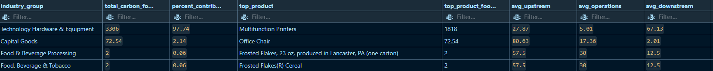

# Analyzing Industry Carbon Emissions

This project analyzes a dataset of product carbon emissions, focusing on industries that contribute to over 75% of global emissions. Using **SQL** and **Visual Studio Code**, the project identifies high-emitting industries, calculates their percentage contributions, and highlights top-emitting products. The goal is to provide actionable insights for sustainability initiatives.

---

## **Project Overview**
- **Dataset**: Contains product-level carbon emissions data, including industry, product name, carbon footprint, and upstream/downstream contributions.
- **Tools Used**: SQL, Visual Studio Code, SQLite.
- **Key Insights**:
  - Total carbon footprint by industry.
  - Percentage contribution of each industry to global emissions.
  - Top-emitting products in each industry.
  - Average upstream, operations, and downstream contributions.

---

## **Output**
Below is an example of the analysis results:

 <!-- Replace with your actual image file -->

---

## **SQL Queries**
The project uses advanced SQL techniques, including:
- **Aggregations**: Calculate total carbon footprint by industry.
- **Window Functions**: Rank top-emitting products in each industry.
- **CTEs (Common Table Expressions)**: Simplify complex queries.
- **Subqueries**: Calculate percentage contributions and averages.
