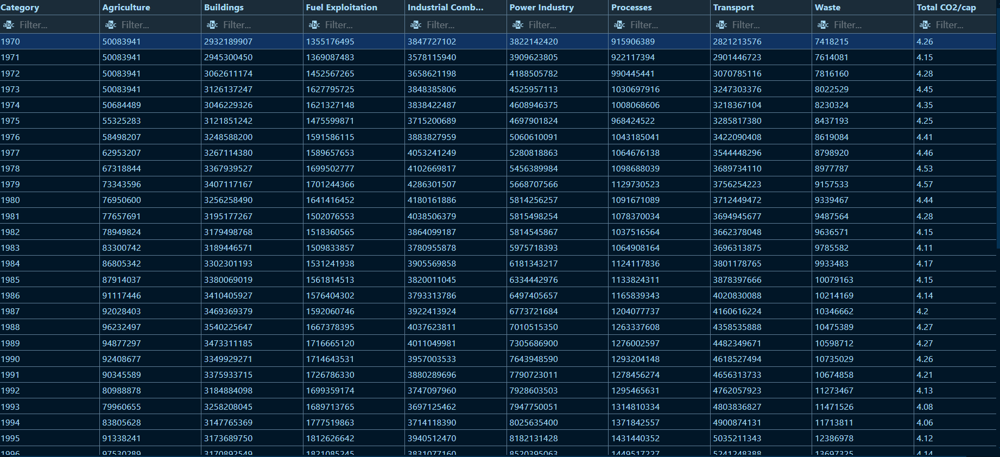
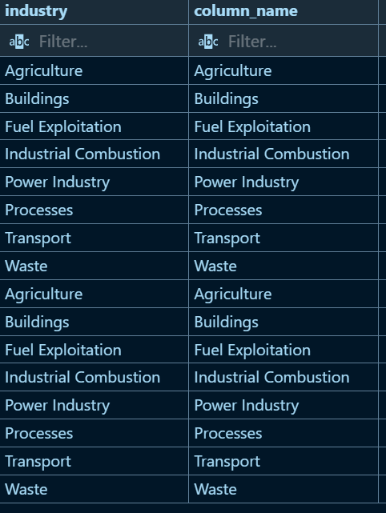
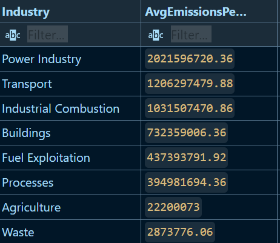
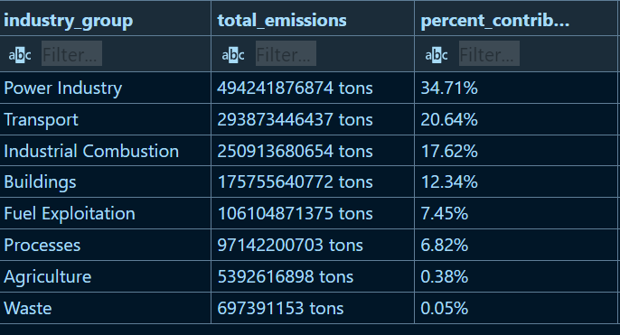
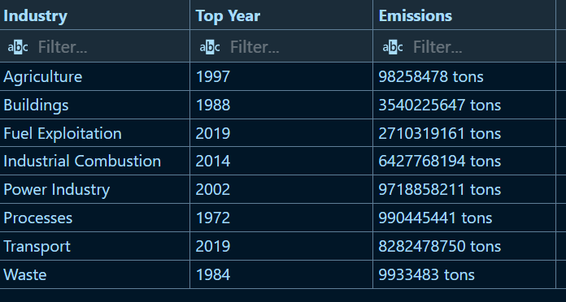

markdown
Copy
# Analyzing Industry Carbon Emissions

This project analyzes a dataset of carbon emissions across various industries, focusing on their contributions to global emissions. Using **SQL** and **Visual Studio Code**, the project calculates total emissions, average emissions per capita, and identifies the top-emitting years for each industry. The goal is to provide actionable insights for sustainability initiatives.

---

## **Project Overview**
- **Dataset**: Contains industry-level carbon emissions data, including emissions from Agriculture, Buildings, Fuel Exploitation, Industrial Combustion, Power Industry, Processes, Transport, and Waste.
- **Tools Used**: SQL, Visual Studio Code, MySQL.
- **Key Insights**:
  - Total emissions by industry across all years.
  - Average emissions per capita for each industry.
  - Top-emitting year for each industry.

---

## **Tables**

### **Carbon Emissions Table (Partial Picture)**

### **Look Up Table**

---

## **Output**
Below is an example of the analysis results:

### **Average Emissions per Capita by Industry**

### **Industry-Wise Total Emissions Across All Years**

### **Top Year for Each Industry**

---
